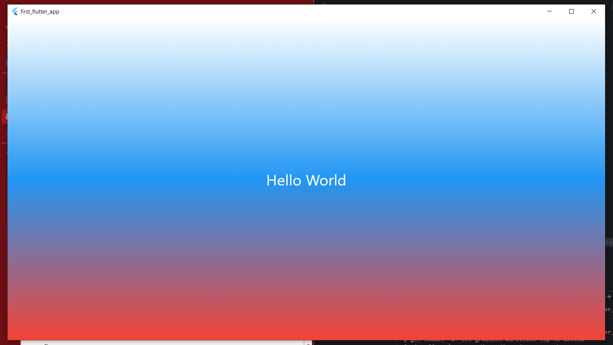

# Лабораторная работа №2. Знакомство с Flutter

## Описание

Познакомиться с основным инструментом кроссплатформенной разработки — Flutter. Создать и запустить первый Flutter-проект в браузере Chrome, изучить структуру проекта и базовые концепции фреймворка — виджеты и дерево виджетов.

## Автор

**ФИО:** Морозова О. С.

**Группа:** ИСП-231

**Дата:** 08.04.2026

## Стек и версии

Flutter 3.x.x; Dart 3.x.x; Платформа: Web (Edge)

IDE: VS Code

## Скриншот приложения

## Как запустить

1. Клонировать репозиторий
2. Перейти в папку проекта
3. Выполнить `flutter pub get`
4. Запустить командой `flutter run -d (ваш браузер)`

## Что изучили

* Основы Flutter
* Дерево виджетов и его построение (MaterialApp → Scaffold → Container → Center → Text)
* Использование Hot Reload (r) и Hot Restart (R) для быстрой разработки
* Подключение к GitHub и базовый .gitignore для Flutter-проектов
